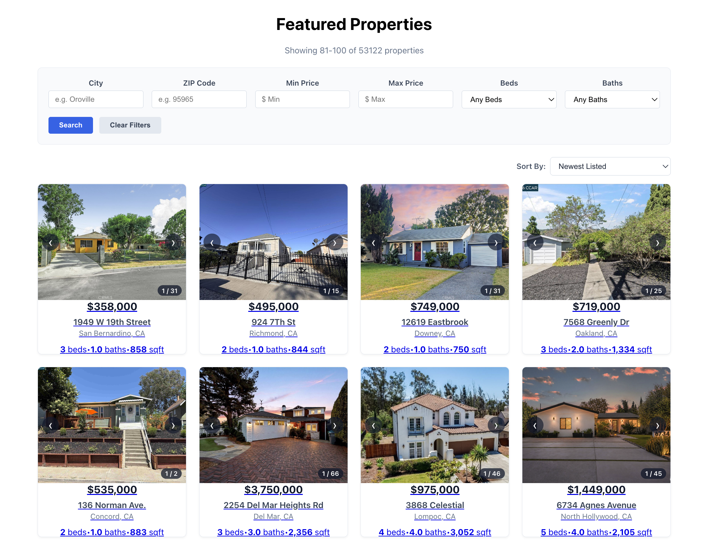

# IDX-Exchange-Summer-2026-Software-Development
This is my code for a Zillow/Redfin-style property search experience backed by real MLS data.



---

## Tech Stack & Versions

- **Frontend:** React 18, React Router v6, CSS Modules
- **Backend:** Node.js (v20+), Express 4.x
- **Database:** MySQL 8.0 (Docker container)
- **Database Driver:** `mysql2/promise` (Connection Pooling)
- **Testing:** Jest, Supertest, React Testing Library
- **Linting:** ESLint

---

## Architecture Overview

```text
├── backend/
│   ├── src/
│   │   ├── routes/properties.js   # Dynamic parameterized queries & endpoints
│   │   ├── db.js                  # MySQL2 connection pooling
│   │   └── server.js              # Express app, logging middleware, CORS
│   └── tests/                     # Jest + Supertest API route integration tests
│
└── frontend/
    └── src/
        ├── api/                   # Isolated API client module (fetch wrapper)
        ├── components/            # Reusable UI widgets (Card, Filters, Carousel, Pagination)
        ├── hooks/                 # Reusable React lifecycle hooks
        ├── pages/                 # Route views (ListingsPage, PropertyDetailPage)
        └── utils/                 # Defensive data formatters and JSON parsers
---

## Local Setup (Fresh Machine Instructions)

### 1. Prerequisites
Install Docker Desktop and Node.js LTS on your system[cite: 1]:
- [Docker Desktop](https://www.docker.com/)[cite: 1]
- [Node.js (LTS)](https://nodejs.org/) (or via Homebrew: `brew install node`)[cite: 1]

### 2. Clone the Repository
```bash
git clone [https://github.com/ryanli2029-cmd/IDX-Exchange-Summer-2026-Software-Development.git](https://github.com/ryanli2029-cmd/IDX-Exchange-Summer-2026-Software-Development.git)
cd IDX-Exchange-Summer-2026-Software-Development
```

### 3. Database Setup via Docker
1. Start the MySQL 8 container[cite: 1]:
   ```bash
   docker run -d --name idx-mysql-local -p 3306:3306 -e MYSQL_ROOT_PASSWORD=secretpassword -e MYSQL_DATABASE=rets mysql:8
   ```
2. Import the database dump files into the container[cite: 1]:
   ```bash
   docker exec -i idx-mysql-local mysql -u root -psecretpassword rets < rets_property.sql
   docker exec -i idx-mysql-local mysql -u root -psecretpassword rets < rets_openhouse.sql
   ```
3. Apply performance indexes for query sorting and filtering:
   ```bash
   docker exec -i idx-mysql-local mysql -u root -psecretpassword rets -e "
   SET SESSION sql_mode = '';
   CREATE INDEX idx_listing_price ON rets_property (L_SystemPrice);
   CREATE INDEX idx_listing_date ON rets_property (ListingContractDate);
   CREATE INDEX idx_city_price ON rets_property (L_City, L_SystemPrice);
   CREATE INDEX idx_zip_price ON rets_property (L_Zip, L_SystemPrice);
   "
   ```

### 4. Backend Environment Configuration
Create a `.env` file inside the `backend/` folder:
```env
PORT=5001
DB_HOST=127.0.0.1
DB_PORT=3306
DB_USER=root
DB_PASSWORD=secretpassword
DB_NAME=rets
```
*(Port 5001 is used to prevent port conflicts with macOS AirPlay Receiver).*

### 5. Install Dependencies
```bash
# Install backend dependencies
cd backend && npm install

# Install frontend dependencies
cd ../frontend && npm install
```

### 6. Run the Application
Open two separate terminal windows:

- **Terminal 1 (Backend API):**
  ```bash
  cd backend
  npm run dev
  # Express listening at http://localhost:5001
  ```

- **Terminal 2 (Frontend Client):**
  ```bash
  cd frontend
  npm start
  # React app opens at http://localhost:3000
  ```

---

## Database Schema & Column Mapping

The application maps raw RETS/MLS table columns to standardized API response keys:

### `rets_property`
| SQL Column | API Key | Type | Description |
| :--- | :--- | :--- | :--- |
| `L_ListingID` | `L_ListingID` | VARCHAR | Primary identifier for the property |
| `L_SystemPrice` | `L_SystemPrice` | DECIMAL | Current listing price (indexed) |
| `ListingContractDate` | `ListingContractDate` | DATE | Initial market entry date (indexed) |
| `L_Address` | `L_Address` | VARCHAR | Street address |
| `L_City` | `L_City` | VARCHAR | Municipality (indexed) |
| `L_State` | `L_State` | VARCHAR | State abbreviation |
| `L_Zip` | `L_Zip` | VARCHAR | Postal code (indexed) |
| `L_Keyword2` | `L_Keyword2` | VARCHAR | Bedroom count |
| `LM_Dec_3` | `LM_Dec_3` | DECIMAL | Bathroom count |
| `LM_Int2_3` | `LM_Int2_3` | INT | Living area square footage |
| `L_Remarks` | `L_Remarks` | TEXT | Public description text |
| `L_Photos` | `L_Photos` | LONGTEXT | Raw JSON array string storing photo URLs |

### `rets_openhouse`
| SQL Column | API Key | Type | Description |
| :--- | :--- | :--- | :--- |
| `id` | `id` | INT | Primary key |
| `L_ListingID` | `L_ListingID` | VARCHAR | Foreign reference linking to `rets_property.L_ListingID` |
| `OpenHouseDate` | `OpenHouseDate` | DATE | Event calendar date |
| `OH_StartTime` | `OH_StartTime` | TIME | Showing start time |
| `OH_EndTime` | `OH_EndTime` | TIME | Showing end time |
| `all_data` | `all_data` | JSON / TEXT | Raw MLS payload blob |

---

## API Reference

### 1. Search Properties
`GET /api/properties`

Returns a paginated list of properties with the total count matching the query.

**Query Parameters:**
- `city` (string) — Filter by municipality (case-insensitive)
- `zipcode` (string) — Filter by ZIP code
- `minPrice` / `maxPrice` (number) — Filter by price range
- `beds` / `baths` (number) — Minimum bedroom/bathroom thresholds
- `sortBy` (string) — `price`, `date`, `sqft`, `beds`, `id` (default: `date`)
- `sortOrder` (string) — `ASC` or `DESC` (default: `DESC`)
- `limit` (number) — Page size between 1 and 100 (default: 20)
- `offset` (number) — Records to skip (default: 0)

**Example Request:**
```bash
GET /api/properties?city=Oroville&minPrice=200000&sortBy=price&sortOrder=ASC&limit=2
```

**Example Response (200 OK):**
```json
{
  "total": 119,
  "limit": 2,
  "offset": 0,
  "sortBy": "price",
  "sortOrder": "ASC",
  "results": [
    {
      "L_ListingID": "1118422731",
      "L_SystemPrice": 225000,
      "L_Address": "123 Pine St",
      "L_City": "Oroville",
      "L_State": "CA",
      "L_Zip": "95965",
      "L_Keyword2": "3",
      "LM_Dec_3": "2.0",
      "LM_Int2_3": "1450",
      "L_Photos": "[\"[https://images.idxexchange.com/photo1.jpg](https://images.idxexchange.com/photo1.jpg)\"]"
    },
    {
      "L_ListingID": "1118422732",
      "L_SystemPrice": 239000,
      "L_Address": "456 Oak Way",
      "L_City": "Oroville",
      "L_State": "CA",
      "L_Zip": "95965",
      "L_Keyword2": "3",
      "LM_Dec_3": "2.0",
      "LM_Int2_3": "1600",
      "L_Photos": "[\"[https://images.idxexchange.com/photo2.jpg](https://images.idxexchange.com/photo2.jpg)\"]"
    }
  ]
}
```

---

### 2. Single Property Detail
`GET /api/properties/:id`

Retrieves all details for a single property listing.

**Example Request:**
```bash
GET /api/properties/1118422731
```

**Example Response (200 OK):**
```json
{
  "L_ListingID": "1118422731",
  "L_SystemPrice": 225000,
  "L_Address": "123 Pine St",
  "L_City": "Oroville",
  "L_State": "CA",
  "L_Zip": "95965",
  "L_Keyword2": "3",
  "LM_Dec_3": "2.0",
  "LM_Int2_3": "1450",
  "L_Remarks": "Charming single-family home with upgraded kitchen and private yard.",
  "L_Photos": "[\"[https://images.idxexchange.com/photo1.jpg](https://images.idxexchange.com/photo1.jpg)\"]"
}
```

**Error Responses:**
- `400 Bad Request`: `{"error": "Invalid Listing ID. Must be a numeric string under 20 characters."}`
- `404 Not Found`: `{"error": "Property not found."}`

---

### 3. Open Houses by Property ID
`GET /api/properties/:id/openhouses`

Retrieves scheduled open house events for a listing, ordered chronologically.

**Example Request:**
```bash
GET /api/properties/1118422731/openhouses
```

**Example Response (200 OK):**
```json
[
  {
    "id": 12,
    "L_ListingID": "1118422731",
    "OpenHouseDate": "2026-10-15",
    "OH_StartTime": "13:00:00",
    "OH_EndTime": "16:00:00"
  }
]
```

*(Returns `[]` if property exists with no scheduled events. Returns `404` if property does not exist).*

---

## Running Automated Tests & Coverage

Run both suites to verify tests pass and reach the 70%+ coverage threshold:

### Backend Tests (Jest + Supertest)
```bash
cd backend
npm run test:coverage
```

### Frontend Tests (React Testing Library + Jest)
```bash
cd frontend
npm test -- --coverage --watchAll=false
```

### Linter Check
```bash
cd frontend
npm run lint
```

---

## Known Issues & Future Improvements

1. **RETS Malformed JSON Blobs:** The `all_data` column in `rets_openhouse` contains occasional unescaped characters and malformed JSON syntax. Backend endpoints use defensive `try/catch` wrappers to prevent unhandled promise rejections from crashing the Node process.
2. **Defensive Photo Array Extraction:** The `L_Photos` column stores image URLs as raw text strings, null values, or empty arrays. The frontend isolates image resolution through `getPhotoArray()` in `frontend/src/utils/formatters.js` to guard against rendering crashes.
3. **Spatial Search Expansion:** Current search logic evaluates exact string equality on city and postal codes. Future iterations will introduce geospatial indexing using MySQL Spatial Extensions (`ST_Distance_Sphere`) for radius-based proximity searches.
